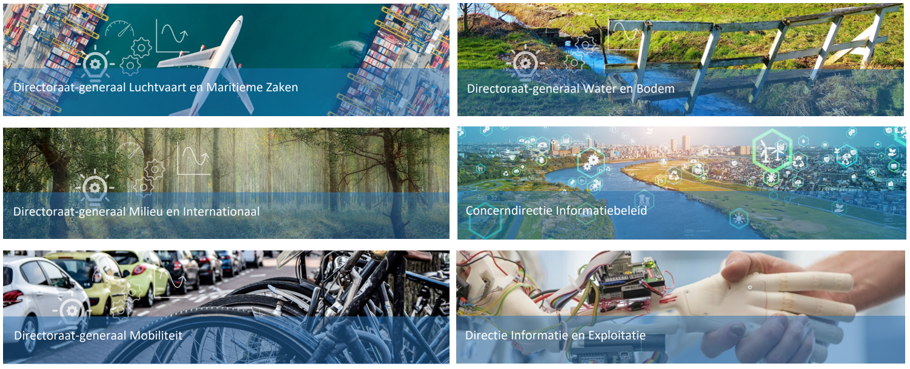

<section id="table-of-contents" class="toc">
  <header>
    <h3>Overview</h3>
  </header>

*  Auto generated table of contents
{:toc}

</section><!-- /#table-of-contents -->

Alle uitgevoerde projecten vallen onder een van de directie onderdelen.
Download het intake formulier [hier](https://gitlab.com/datainnovatielab/intakes/intakeformulieren/-/blob/main/intakes/intake_DI_Lab_template.docx?ref_type=heads)
 

---

---

## Luchtvaart en Maritiem

Het directoraat-generaal Luchtvaart en Maritieme Zaken (DGLM) is
een van de vier beleidsdirectoraten-generaal binnen het ministerie
van Infrastructuur en Waterstaat. Het directoraat-generaal bestaat
uit een directie Luchtvaart, een directie Maritieme Zaken en een
programma Luchtvaart.

---

## Milieu en Internationaal

Het directoraat-generaal Milieu en Internationaal (DGMI) bevordert
een gezonde, veilige, schone en duurzame leefomgeving. De meest in
het oog springende nationale onderwerpen zijn: circulaire economie,
luchtkwaliteit, geluid, statiegeld, afval, vuurwerk, stoffenbeleid,
nucleaire veiligheid, asbest, basisnet, biotechnologie, het stelsel van
vergunningverlening, handhaving en toezicht (VTH) en het Nationaal
milieuprogramma. 

---

## Mobiliteit

Het directoraat-generaal Mobiliteit (DGMo) heeft als doel om de
netwerkkwaliteit van spoorwegen alsmede het wegennet verder
te ontwikkelen evenals het veilige en duurzame gebruik daarvan
door reizigers en de transportsector te waarborgen. Daarmee wordt
bijgedragen aan de economische en ruimtelijke ontwikkeling van
Nederland binnen de condities van leefbaarheid en veiligheid. Dit
doet DGMo op een integrale manier, van modaliteit naar mobiliteit

---

## Water en Bodem

Het directoraat-generaal Water en Bodem (DGWB) zorgt samen met
anderen voor de bescherming van Nederland tegen hoogwater, voor
een verantwoord (mede-)gebruik en ruimtelijke ordening van de zee
en voor een duurzaam en veilig gebruik van het water-bodemsysteem
dat bestand is tegen wateroverlast en droogte en blijvend kan voorzien
in de juiste hoeveelheid water, van de juiste kwaliteit, op de juiste
plaats. We geven richting en invulling aan klimaatadaptatie door
de (internationale) klimaatopgaven te vertalen naar uitvoerbaar en
toekomstbestendig beleid als sturend fundament voor de inrichting van
de fysieke leefomgeving. Zo dragen we bij aan een veilig, leefbaar en
bereikbaar Nederland. 

---

## Concerndirectie informatiebeleid

Financiën en Integrale Bedrijfsvoering (FIB) is de gezamenlijke naam
voor alle bedrijfsvoeringsdirecties van IenW. Onder FIB vallen de
concerndirecties Bedrijfsvoering die een IenW-breed verantwoordelijke
zijn voor het ontwikkelen, ontwerpen en implementeren van
Bedrijfsvoeringsbeleid en -kaders. Ook valt onder FIB de directie
Uitvoering, Decentraal Advies en Control die verantwoordelijk is voor
de uitvoerende taken van de bedrijfsvoering voor de Bestuurskern van
IenW en (deels) voor de agentschappen. 

---

## Directie Informatie en Exploitatie

Directie Informatie en Exploitatie is verantwoordelijk voor alle vormen
van dienstverlening op ICT-gebied van gebruikersondersteuning en
beheer via leveranciersmanagement en projectuitvoering tot en met
(strategisch) advies;

---

## Intakes

<!-- Include dilab.html here 
<object type="text/html" data="dilab.html" width="1600px" height="220px"></object>
-->
