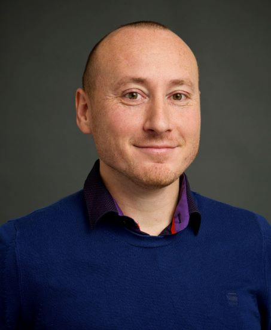

Het Data en Innovatielab is een dynamisch team van vaste medewerkers, Trainnees, Stagairs, PhD student(en) en Externe medewerkers.
Met team werken wij aan use-cases in de focus gebieden van Business Intelligence, Data Science, No code/Low code maar ook wetenschappelijk onderzoek
op verschillende aandachtsgebieden die IenW direct helpen.

<html lang="en">
<head>
    <meta charset="UTF-8">
    <meta name="viewport" content="width=device-width, initial-scale=1.0">
    <title>Table Example</title>
    
</head>
<body>

<table border="0">
    <tr>
        <td>
             
            <a href="https://nl.linkedin.com/in/erdogant" target="_blank">Erdogan Taskesen (Afd.Hoofd)</a>
        </td>
        <td>
             
            <a href="https://www.linkedin.com/in/angie-munshi/" target="_blank">Angie Munshi (Lead Data/BI)</a>
        </td>
        <td>
             
            <a href="https://www.linkedin.com/in/tijnschouten/" target="_blank">Tijn Schouten (Lead Data Scientist)</a>
        </td>
    </tr>

    <tr>
        <td>
             
            Edwin van Bentum (BI)
        </td>
        <td>
             
            <a href="https://www.linkedin.com/in/iain-van-toor-640777199/" target="_blank">Iain van Toor (Data Scientist)</a>
        </td>
        <td>
             
            <a href="https://www.linkedin.com/in/tonflick/" target="_blank">Ton Flick</a>
        </td>
    </tr>

    <tr>
        <td>
             
            Jan Perdaan (Modeleur)
        </td>
        <td>
             
            <a href="https://www.linkedin.com/in/kimberleyhuijskens/" target="_blank">Kimberley Huijskens (Trainee, Data Scientist)</a>
	</td>
        <td>
             
            <a href="https://www.linkedin.com/in/jos-zuijderwijk-487b17151/" target="_blank">Jos Zuijderwijk (PhD Student)</a>
        </td>
    </tr>

    <tr>
        <td>
             
            Peter Bakker (Stagair)
	</td>
        <td>
             
            <a href="https://www.linkedin.com/in/jeffrey-manders/" target="_blank">Jeffrey Manders (Engineer)</a>
        </td>
        <td>
             
            <a href="https://www.linkedin.com/in/bevdp/" target="_blank">Bastiaan vd Palen (Engineer)</a>
        </td>
    </tr>

    <tr>
        <td>
             
            <a href="https://www.linkedin.com/in/stefano-broekhuizen/" target="_blank">Stefano Broekhuizen (Modeleur)</a>
        </td>

	<td>
	<!-- new -->
        </td>

    </tr>

</table>

</body>
</html>

