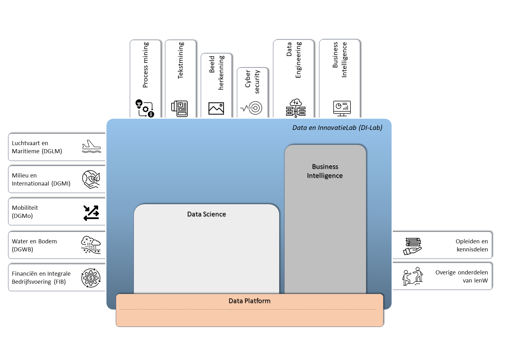

De scope van Data en Innovatielab is gebaseerd op zowel de behoeften vanuit de directies wat samen te vatten is in de activiteiten op het gebied van data/opslag tezamen met innovatie en modernisering. Wij organiseren dit in de toekomst centraal vanuit het Data en Innovatielab. De scope van het Data en Innovatielab omvat de volgende aandachtsgebieden:

<html>
<head>
<meta name="viewport" content="width=device-width, initial-scale=1">

</head>
<body>

<button class="collapsible">Data Platform</button>

  
 
	Het zorgdragen voor een goede data opslag en toegang om taken efficiënt en betrouwbaar uit te voeren. Dit vormt het fundament om de hieronder genoemde onderdelen flexibel en kosteneffectief te beheren voor datagestuurde besluitvorming en beleidsdoelen;
  

<button class="collapsible">Business Intelligence (BI)</button>

  
 
	Ontwikkelen van dashboards om tot snelle inzichten te komen uit de grote hoeveelheden (on)gestructureerde data sets en op basis hiervan informatie genereren voor beleidsdoelen in de vorm van rapportages en voorspellingen;
  

<button class="collapsible">Data Science</button>

  
 
	Ontdekken van patronen in grote hoeveelheden ongestructureerde teksten met tekstmining en/of op gestructureerde data sets op basis van sensorgegevens (IoT) tbv monitoren en voorspellen van prestaties van (deel)objecten en het ontwikkelen van rapportages. Daarnaast ook bijvoorbeeld het automatisch kwantificeren aan de hand van video en beeldmateriaal ter ondersteuning aan beleidsdoelen (Beeldherkenning). Tot slot het analyseren en ontdekken van patronen in workflows en processen door data te combineren met organisatorische gegeven (procesmining)

<button class="collapsible">No code/ Low code</button>

  
 
	Het gebruik van no code en low code ontwikkelingsplatforms biedt IenE de mogelijkheid om applicaties en workflows te ontwikkelen zonder diepgaande programmeerkennis. Met deze benaderingen kan DI-Lab snel en efficiënt oplossingen bouwen en aanpassen aan de specifieke behoeften. Dit vergroot de productiviteit en wendbaarheid omdat wij op deze manier niet volledig afhankelijk zijn van traditionele softwareontwikkelingscycli. De no code/low code ontwikkelingen zijn bij start niet direct gekoppeld aan het cloud platform.

<button class="collapsible">Kennisdeling en Onderzoek</button>

  
 
	Het delen van kennis is enerzijds voor betere bewustwording hoe data en nieuwe technieken kunnen helpen in projecten, daarnaast zullen wij vanuit het Data en Innovatielab ook aan kennisproducten werken, denk aan Hackathons maar ook het toezien op het verantwoordelijk gebruik van artificiële intelligentie (AI) binnen de organisatie. Binnen het team hebben wij ook een onderzoekstak waar wij samen met Hogescholen en Universiteiten onderzoek doen naar relevante vraagstukken binnen de kaders van IenW.

	  
	
	Bij het uitvoeren van projecten kan het Data en Innovatielab ook expirementeren met nieuwe technieken en standaarden, zodat onderbouwde vragen voor ontbrekende functionaliteit in het huidige aanbod gesteld kunnen worden en bij gebleken geschiktheid kunnen leiden tot nieuwe standaard bouwstenen (uniformeren/ standaardiseren) en te helpen om deze uiteindelijk naar productie te krijgen. 
	
	  
	
	Tot slot verspreidt DI-Lab actief de opgedane kennis en inspiratie op het gebied van data science door het geven van workshops, lezingen en opleidingen en het bieden van werkervaringsplaatsen.

  

</body>
</html>

  

 

## Werkwijze

Het Data en Innovatielab volgt het vastgestelde proces van innoveren, uniformeren en produceren waarbij het een belangrijke bijdrage levert aan het innoveren en uniformeren (standaardiseren). 

DI-Lab voert projecten uit die in een relatief kort tijdsbestek nieuwe technieken zichtbaar en voelbaar maken voor de opdrachtgever, inclusief wat ze kunnen betekenen voor het werk van IenW en de service voor de gebruiker van onze netwerken (innoveren). Het resultaat van deze projecten is een zogenaamd Proof of Concepts (PoC’s), Minimum Viable Product (MVP), een advies en/of een kennisproduct. Deze vormen een uitgangspunt voor verdere ontwikkeling binnen de IenE. 

De werkwijze bij DI-Lab is agile, dat wil zeggen dat projecten zoveel mogelijk worden belegd in één van de scrum teams van DI-Lab. De werkzaamheden worden gestart met een kick-off en uitgevoerd in een aantal sprints met een refinementsessie, sprintplanning, retrospectives, tussentijdse demo’s en afgesloten met een eindpresentatie. Richtlijn is dat een PoC-project initieel niet meer dan 3 maanden mag kosten om tot een eerste resultaat te komen. Uitzonderingen zijn bijvoorbeeld projecten die worden uitgevoerd middels een inkoop op productbasis, een adviesproject waarin iemand van DI-Lab participeert in een projectteam van de opdrachtgever of evenementen met inhoudelijke inbreng over data science, al dan niet georganiseerd door DI-Lab.

